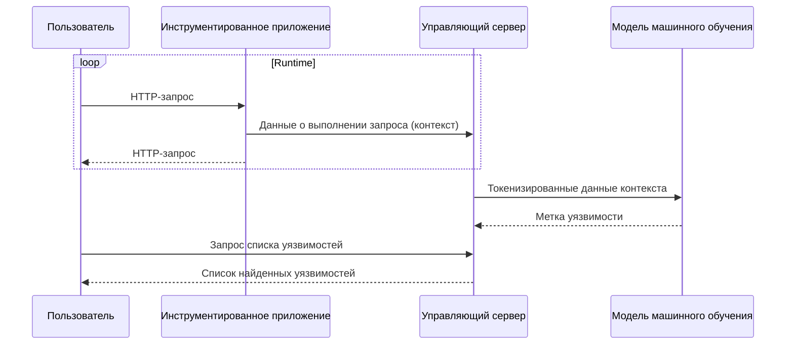

<p align="center">

</p>

<hr/>

<p align="center">


</p>

<p align="center">
Система интерактивного анализа веб-приложений на Python (Interactive Application Security Testing, IAST), разработанная в рамках моего дипломного проекта.
</p>

> [!TIP]
> Репозиторий перенёс <a href="https://github.com/Immunity-IAST/">отсюда</a>, чтобы улучшал мне статистику на профиле, так что актульная версия содержится в данном репозитории.

## Содержание

<!-- TOC -->
  * [Содержание](#содержание)
  * [Результаты работы](#результаты-работы)
  * [Демо](#демо)
  * [Аппаратные требования](#аппаратные-требования)
  * [Подготовка сервера](#подготовка-сервера)
  * [Запуск системы](#запуск-системы)
<!-- TOC -->

## Результаты работы

- разработан [агент интерактивного анализа](https://github.com/light-hat/immunity-python-agent);
- разработан управляющий сервер (данный репозиторий);
- собран [обучающий набор данных](https://huggingface.co/datasets/l1ghth4t/iast-python3-django-flask);
- выполнено [трансферное обучение модели BERT](https://huggingface.co/l1ghth4t/immunity) для задачи выявления уязвимостей;
- разработан [тестовый стенд](https://github.com/light-hat/devsecops-stand), описывающий внедрение системы в процессы DevSecOps.

## Концепция

Общая схема работы проекта:



Что такое IAST и как он работает описано [отдельно](Theory.md).

## Демо

(todo: демо)

## Аппаратные требования

> [!NOTE]
> Сервер с указанными характеристиками использовался для разработки и тестирования системы.

| Параметр | Значение                 |
|----------|--------------------------|
| OS       | Ubuntu 22.04 LTS 64-bit  |
| CPU      | 4 ядра                   |
| RAM      | 32 ГБ                    |
| GPU      | 1 × Tesla T4  16 ГБ      |

## Подготовка сервера

> [!IMPORTANT]
> Установите `Docker` и `Docker Compose` на сервер, используя данную [инструкцию](https://docs.docker.com/engine/install/ubuntu/) с официального сайта Docker.

Когда установлен Docker, проверьте драйвера видеокарты:

```shell
nvidia-smi
```

<details>
  <summary>👀 Что примерно должно быть в ответе</summary>

<hr />

```
Sat Jan  4 01:37:28 2025       
+---------------------------------------------------------------------------------------+
| NVIDIA-SMI 535.183.01             Driver Version: 535.183.01   CUDA Version: 12.2     |
|-----------------------------------------+----------------------+----------------------+
| GPU  Name                 Persistence-M | Bus-Id        Disp.A | Volatile Uncorr. ECC |
| Fan  Temp   Perf          Pwr:Usage/Cap |         Memory-Usage | GPU-Util  Compute M. |
|                                         |                      |               MIG M. |
|=========================================+======================+======================|
|   0  Tesla T4                       Off | 00000000:00:06.0 Off |                  Off |
| N/A   49C    P0              28W /  70W |    783MiB / 16384MiB |      0%      Default |
|                                         |                      |                  N/A |
+-----------------------------------------+----------------------+----------------------+
```

<hr />

</details>

<details>
  <summary>👀 Как поставить драйвера на GPU</summary>

<hr />

Устанавливаем инструменты для компиляции драйверов и заголовки ядра:

```shell
sudo apt update
sudo apt-get install build-essential linux-headers-$(uname -r)
```

Ищем доступные версии драйвера:

```shell
ubuntu-drivers devices
```

Находим в выводе похожую строчку:

```text
...
driver   : nvidia-driver-535 - distro non-free recommended
...
```

Это версия драйвера, которую вам нужно установить. Делаем это:

```shell
sudo apt-get install nvidia-driver-535
```

Затем перезапускаем сервер:

```shell
sudo reboot
```

После перезагрузки снова проверяем драйвера GPU:

```shell
nvidia-smi
```

<hr />

</details>

После этого проверьте, установлен ли на сервере `NVIDIA Container Toolkit`:

```shell
dpkg -l | grep nvidia-container-toolkit
```

<details>
  <summary>👀 Что примерно должно быть в ответе</summary>

<hr />

```
ii  nvidia-container-toolkit          1.17.3-1          amd64     NVIDIA Container toolkit
ii  nvidia-container-toolkit-base     1.17.3-1          amd64     NVIDIA Container Toolkit Base

```

<hr />

</details>

> [!TIP]
> Если в этом ответе пусто, вот [мануал](https://docs.nvidia.com/datacenter/cloud-native/container-toolkit/latest/install-guide.html) c официального сайта как установить `NVIDIA Container Toolkit`.

> [!WARNING]
> После установки `NVIDIA Container Toolkit` не забудьте перезапустить `Docker`. Команда приведена ниже.

```shell
sudo systemctl restart docker
```

## Запуск системы

1. Клонируйте репозиторий:

```shell
git clone https://github.com/light-hat/immunity-iast
cd immunity-iast
```

2. Настройте проект перед запуском:

```shell
make config
```

<details>

  <summary>👀 Переменные окружения в конфигурации</summary>

<hr />

- `API_URL`: адрес, на котором будет развёрнут сервис;

- `API_PORT`: порт, на котором будет принимать запросы сервис;

- `POSTGRES_HOST`: хост базы данных (имя сервиса в стеке приложений);

- `POSTGRES_PORT`: порт базы данных;

- `POSTGRES_USER`: пользователь базы данных;

- `POSTGRES_PASSWORD`: пароль от базы данных;

- `POSTGRES_DB`: имя базы данных, используемой сервисом;

<hr />

</details>

3. Запустите стек приложений:

```shell
make up
```

4. Проверьте логи

<details>
  <summary>👀 Как выглядит здоровый лог при запуске</summary>

<hr />

Лог основного приложения:

```shell
make logs | grep immunity
```

```text
immunity-1    | DB not yet run...
immunity-1    | DB did run.
immunity-1    | Migrations for 'core':
immunity-1    |   core/migrations/0001_initial.py
immunity-1    |     + Create model Context
immunity-1    |     + Create model DatasetLabel
immunity-1    |     + Create model Library
immunity-1    |     + Create model Project
immunity-1    |     + Create model User
immunity-1    |     + Create model DependencyVulnerability
immunity-1    |     + Add field project to library
immunity-1    |     + Create model Event
immunity-1    |     + Add field project to context
immunity-1    |     + Create model Configuration
immunity-1    |     + Create model Request
immunity-1    |     + Create model Response
immunity-1    |     + Create model Vulnerability
immunity-1    | Operations to perform:
immunity-1    |   Apply all migrations: admin, auth, contenttypes, core, sessions
immunity-1    | Running migrations:
immunity-1    |   No migrations to apply.
immunity-1    | 2025-01-31 03:28:00,341 - [INFO] - [MainThread] - core.management.commands.init_users - (init_users.py).handle(21) - Администратор уже создан.
immunity-1    | [2025-01-31 00:28:00 +0000] [12] [INFO] Starting gunicorn 23.0.0
immunity-1    | [2025-01-31 00:28:00 +0000] [12] [INFO] Listening at: http://0.0.0.0:8000 (12)
immunity-1    | [2025-01-31 00:28:00 +0000] [12] [INFO] Using worker: sync
immunity-1    | [2025-01-31 00:28:00 +0000] [13] [INFO] Booting worker with pid: 13
```

Лог асинхронного воркера:

```shell
make logs | grep worker
```

```text
worker-1      |  
worker-1      |  -------------- celery@10488abd3a8b v5.4.0 (opalescent)
worker-1      | --- ***** ----- 
worker-1      | -- ******* ---- Linux-5.15.0-131-generic-x86_64-with-glibc2.36 2025-01-31 03:27:58
worker-1      | - *** --- * --- 
worker-1      | - ** ---------- [config]
worker-1      | - ** ---------- .> app:         conf:0x7f1d7d8c48f0
worker-1      | - ** ---------- .> transport:   redis://redis:6379//
worker-1      | - ** ---------- .> results:     redis://redis:6379/
worker-1      | - *** --- * --- .> concurrency: 4 (prefork)
worker-1      | -- ******* ---- .> task events: OFF (enable -E to monitor tasks in this worker)
worker-1      | --- ***** ----- 
worker-1      |  -------------- [queues]
worker-1      |                 .> celery           exchange=celery(direct) key=celery
worker-1      |                 
worker-1      | 
worker-1      | [tasks]
worker-1      |   . engine.context.handle_config
worker-1      |   . engine.context.handle_context
worker-1      |   . engine.context.handle_dependencies
worker-1      |   . engine.engine.run_analysis_task
worker-1      | 
worker-1      | [2025-01-31 03:27:59,044: WARNING/MainProcess] /usr/local/lib/python3.12/site-packages/celery/worker/consumer/consumer.py:508: CPendingDeprecationWarning: The broker_connection_retry configuration setting will no longer determine
worker-1      | whether broker connection retries are made during startup in Celery 6.0 and above.
worker-1      | If you wish to retain the existing behavior for retrying connections on startup,
worker-1      | you should set broker_connection_retry_on_startup to True.
worker-1      |   warnings.warn(
worker-1      | 
worker-1      | [2025-01-31 03:27:59,054: WARNING/MainProcess] /usr/local/lib/python3.12/site-packages/celery/worker/consumer/consumer.py:508: CPendingDeprecationWarning: The broker_connection_retry configuration setting will no longer determine
worker-1      | whether broker connection retries are made during startup in Celery 6.0 and above.
worker-1      | If you wish to retain the existing behavior for retrying connections on startup,
worker-1      | you should set broker_connection_retry_on_startup to True.
nginx         | /docker-entrypoint.sh: Launching /docker-entrypoint.d/30-tune-worker-processes.sh
worker-1      |   warnings.warn(
worker-1      | 
immunity-1    | [2025-01-31 00:28:00 +0000] [12] [INFO] Using worker: sync
immunity-1    | [2025-01-31 00:28:00 +0000] [13] [INFO] Booting worker with pid: 13
nginx         | 2025/01/31 00:27:57 [notice] 1#1: start worker processes
nginx         | 2025/01/31 00:27:57 [notice] 1#1: start worker process 19
nginx         | 2025/01/31 00:27:57 [notice] 1#1: start worker process 20
nginx         | 2025/01/31 00:27:57 [notice] 1#1: start worker process 21
nginx         | 2025/01/31 00:27:57 [notice] 1#1: start worker process 22
```

<hr />

</details>
