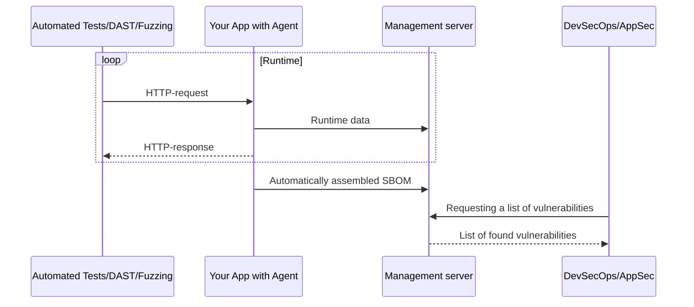

<h1 align="center">Immunity</h1>

Interactive Analysis Platform for Distributed Debugging and Security Testing (IAST, SCA). 

## Stats

## Concept

## Related projects

| Name                  | Type       | Description                                                        | URL                                                                                                      |
| --------------------- | ---------- | ------------------------------------------------------------------ | -------------------------------------------------------------------------------------------------------- |
| immunity-python-agent | IAST agent | IAST agent for interactive analysis of web applications in Python. | [https://github.com/light-hat/immunity-python-agent](https://github.com/light-hat/immunity-python-agent) |

## License

