# Теоретическая часть

<!-- TOC -->
* [Теоретическая часть](#теоретическая-часть)
  * [Концепция](#концепция)
    * [Что такое IAST?](#что-такое-iast)
    * [Классификация IAST](#классификация-iast)
    * [Постановка ML-задачи](#постановка-ml-задачи)
  * [Агент интерактивного анализа](#агент-интерактивного-анализа)
    * [Общая информация](#общая-информация)
    * [Принцип встраивания](#принцип-встраивания)
    * [Собираемая информация](#собираемая-информация)
  * [Управляющий сервер](#управляющий-сервер)
    * [Общая информация](#общая-информация-1)
    * [Инфраструктура](#инфраструктура)
    * [Dockerfile](#dockerfile)
    * [База данных](#база-данных)
    * [API](#api)
  * [Модель машинного обучения](#модель-машинного-обучения)
    * [Датасет](#датасет)
    * [Модель](#модель)
<!-- TOC -->

## Концепция

### Что такое IAST?

**Интерактивный анализ** (Interactive Application Security Testing, IAST) — это гибрид статического и динамического анализа, который позволяет исследовать приложение изнутри во время его работы.

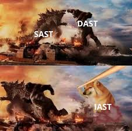

Другими словами:

- **статический анализ** работает с кодом без запуска приложения;
- **динамический анализ** может работать с запущенным приложением, но без доступа к коду;
- **интерактивный анализ** работает с кодом в работающем приложении.

### Классификация IAST

IAST бывают двух типов: `активный` и `пассивный`.

- Принцип работы IAST активного типа:

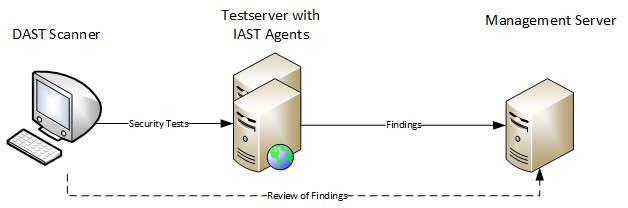

Веб-приложение развёртывается на тестовом сервере и инструментируется агентом интерактивного анализа.

> [!NOTE]
> `Агент интерактивного анализа` — это модуль, встраиваемый в целевое приложение для его инструментирования в рамках интерактивного анализа.

> [!NOTE]
> `Инструментирование` — это добавление в существующую программу блоков кода, позволяющих измерять показатели производительности кода, находить ошибки и извлекать информацию о них для отслеживания причин их возникновения.

Далее проводится динамический анализ (DAST) развёрнутого приложения. В ходе тестирования агент собирает данные о поведении веб-приложения (Findings) и отправляет их на серверную часть (Management Server). Получение информации об уязвимостях осуществляется с серверной части интерактивного сканера (Management Server), как правило она дополняет результаты динамического анализа.

- Принцип работы IAST пассивного типа:

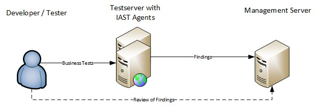

Пассивный IAST состоит из двух компонентов: веб-приложение со встроенным агентом, развёрнутое на тестовом сервере и серверная часть интерактивного сканера (Management Server). Действующее лицо на этой схеме — разработчик либо тестировщик, которые проводят ручные и автоматические тесты, направленные на проверку бизнес-логики приложения.

В ходе таких тестов воспроизводятся возможные действия реальных пользователей. Встроенный агент собирает информацию об обработке запроса (Findings) и отправляет её на сервер для дальнейшего анализа. Получение действующим лицом информации об уязвимостях осуществляется с серверной части интерактивного сканера (Management Server).

> [!TIP]
> Immunity - IAST пассивного типа.

### Постановка ML-задачи

Так как целевой задачей служит поиск уязвимостей в веб-приложениях, причем пользователю нужно вернуть конкретный тип найденной уязвимости, задачей машинного обучения для разработки интерактивного сканера уязвимостей была выбрана `классификация`.

Для задачи классификации используется `обучение с учителем`. Обучение с учителем подразумевает обучение модели на размеченных данных, где каждому входному набору данных соответствует известный целевой выход.

Исходя из того, что обучение модели с нуля требует значительных вычислительных ресурсов и больших объемов данных, для её обучения было выбрано `трансферное обучение`.

> [!NOTE]
> `Трансферное обучение` (Transfer Learning) — это метод машинного обучения, при котором предварительно обученная модель адаптируется для решения новых, схожих задач.

Одним из методов трансферного обучения является `извлечение признаков` (feature extraction), который заключается в использовании выходной информации предварительно обученных моделей, таких как BERT, в качестве входных данных для последующей обработки в пользовательской модели.

## Агент интерактивного анализа

### Общая информация

Репозиторий агента находится [здесь](https://github.com/light-hat/immunity-python-agent). Также для агента создан [PyPI-репозиторий](https://pypi.org/project/immunity-iast/).

Агент интерактивного анализа представляет собой библиотеку на языке Python, предназначенную для интеграции в веб-приложения на языке программирования Python.

Агент интерактивного анализа поддерживает фреймворки для создания веб-приложений `Django` и `Flask`.

### Принцип встраивания

При разработке веб-приложений используется шаблон проектирования Model, View, Controller (MVC) — это шаблон (паттерн) программирования, разделяющий архитектуру приложения на три модуля: модель (Model), представление (View), контроллер (Controller).

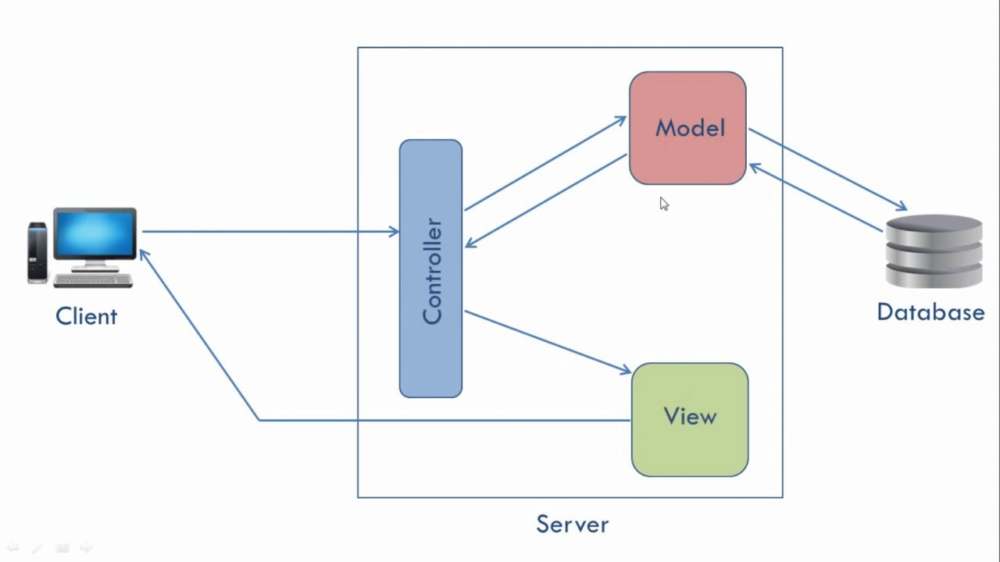

Он позволяет изменять каждый компонент независимо друг от друга для простой разработки и поддержки веб-приложений. Данная архитектура также поддерживает создание промежуточного слоя перед обработкой запроса который называется middleware или `промежуточным ПО`.

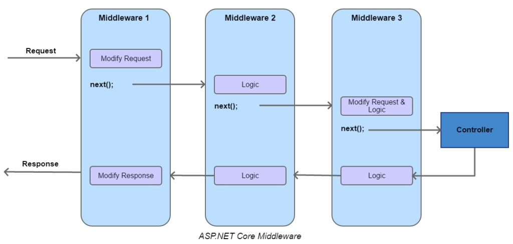

Промежуточное ПО может перехватывать и модифицировать запрос перед передачей его контроллеру. Также может быть встроено несколько последовательных middleware, которые образуют цепочку для предобработки пользовательских запросов. Кроме того, middleware могут обрабатывать ответ веб-приложения, читая или изменяя его при необходимости.

Промежуточное ПО может выполнять роль фильтра, обработчика запросов или аутентификатора. Например, слой обработки запросов может анализировать входящие данные, применять необходимые преобразования и перенаправлять их на соответствующие модули приложения. А в рамках создания IAST, middleware служит идеальной точкой для встраивания в анализируемое веб-приложение.

### Собираемая информация

Агент интерактивного анализа, реализованный как middleware, собирает следующую информацию:

- `исходный код` — интерактивный сканер имеет доступ ко всему исходному коду анализируемого приложения;
- `HTTP-трафик` — также интерактивный сканер имеет доступ ко всей информации об HTTP-запросах и формируемых ответах;
- `поток управления` — сканер может отслеживать поток управления для определения шаблонов поведения приложения, характерных для уязвимостей;
- `внешние вызовы` — есть возможность перехватывать информацию о подключении к базам данных, кешу, брокеру сообщений и другим сервисам, окружающим веб-приложения;
- `используемые библиотеки` — работая изнутри, сканер может извлекать информацию о подключенных библиотеках для поиска уязвимых зависимостей;
- `конфигурация` — интерактивный сканер имеет доступ к параметрам конфигурации приложения, чтобы убедиться, что они правильно настроены для обеспечения безопасности.

## Управляющий сервер

### Общая информация

Управляющий сервер — это веб-приложение, реализованное на фреймворке Django, с пользовательским интерфейсом на Vue.js.

Основное назначение сервера — прием данных от агента интерактивного анализа, их обработка и интерпретация, а также предоставление доступа к списку уязвимостей через веб-интерфейс.

Основные функции управляющего сервера:

- прием данных от агента интерактивного анализа;
- предварительная обработка данных перед подачей их на модель машинного обучения;
- интерпретация результатов работы модели машинного обучения;
- хранение списка приложений и уязвимостей;
- разметка данных для формирования обучающей выборки;
- предоставление веб-интерфейса для работы с данными.

Компоненты управляющего сервера:

- `клиентская часть`: реализована на Vue.js, предоставляет веб-интерфейс для просмотра уязвимостей, разметки данных и управления приложениями;
- `серверная часть`: реализована на Django, предоставляет программный интерфейс в формате REST API для взаимодействия с управляющим сервером;
- `движок интерактивного анализа`: микросервис, выполняющий асинхронные задачи, в частности — анализ входных данных с помощью модели машинного обучения.

Базы данных:

- `PostgreSQL`: реляционная СУБД;
- `Redis`: NoSQL-БД для создания очереди сообщений.

### Инфраструктура

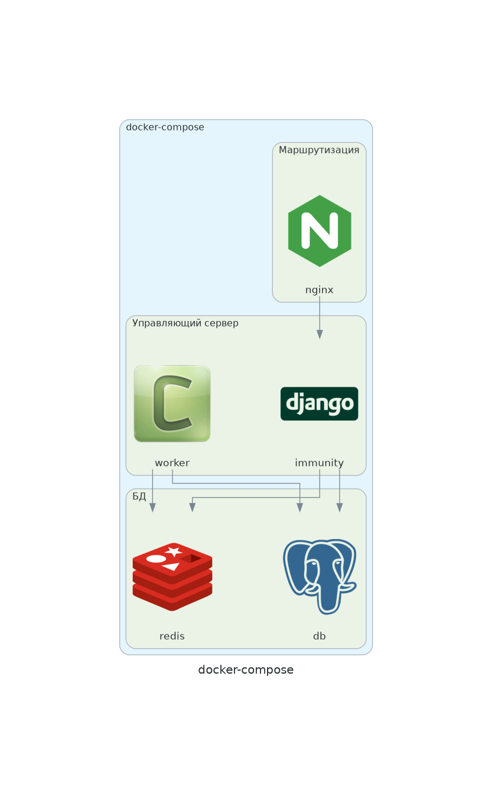

Инфраструктура проекта развёртывается через Docker. Оркестрация контейнеров выполняется при помощи Docker Compose.

Контейнеры:

- `nginx`: Reverse-proxy и раздача статики на проде;
- `immunity`: основное Django-приложение + Vue-фронтэнд собранный в бандл;
- `worker`: асинхронный Celery-воркер, тут выполняются модули движка интерактивного анализа;
- `postgres`: реляционная СУБД для хранения данных;
- `redis`: для очереди задач между основным приложением и воркером.

### Dockerfile

Используется multi-stage сборка проекта.

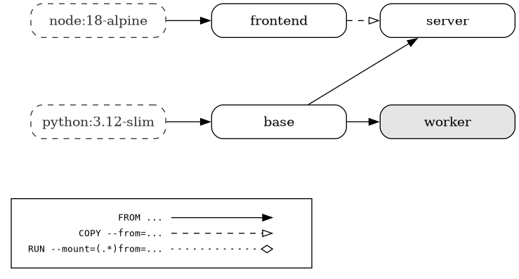

Этапы:

- `frontend`: сборка веб-интерфейса в бандл;
- `base`: установка зависимостей для бэкэнда;
- `server`: сборка образа основного приложения;
- `worker`: сборка образа асинхронного воркера.

### База данных

ERD-диаграммы базы данных проекта:

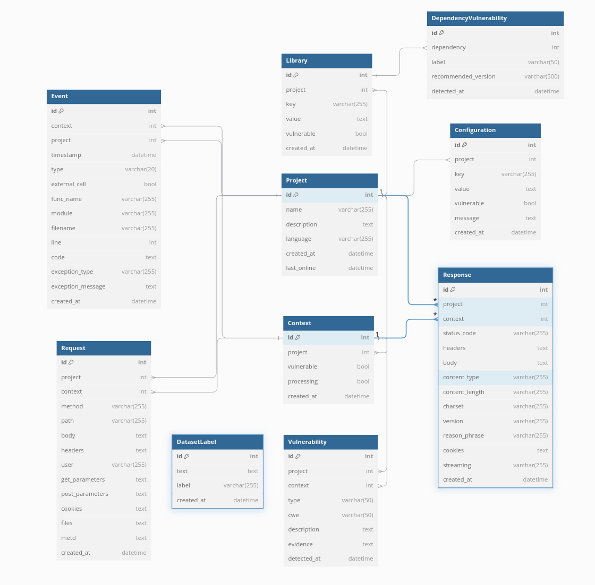

### API

Управляющий сервер имеет два программных интерфейса:

- `/api/users/`: пользовательский API (REST);
- `/api/agent/`: агентский API (REST).

Документация API (Swagger) доступна по адресу `/api/docs`.

> [!NOTE]
> Описывать тут много и мне лень, если интересно - можно развернуть и потыкать руками, там всё просто.

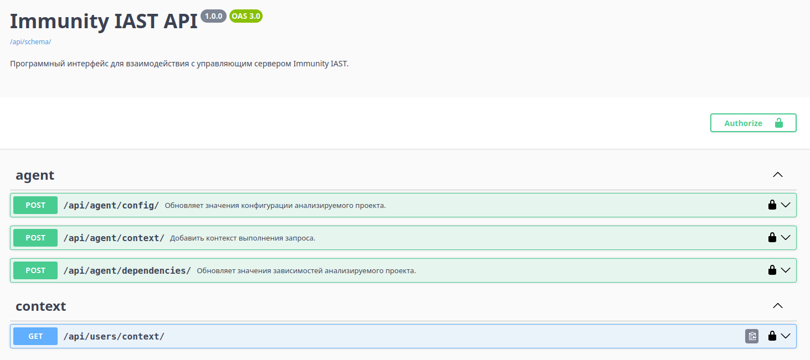
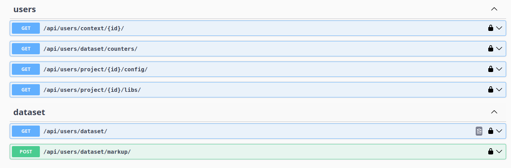
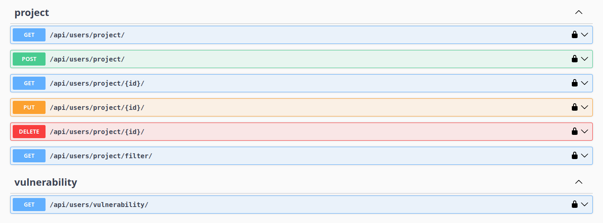

## Модель машинного обучения

### Датасет

Обучающий набор данных опубликован на [Hugging Face Hub](https://huggingface.co/datasets/l1ghth4t/iast-python3-django-flask). Подробности о нём представлены там же.

### Модель

Модель опубликована на [Hugging Face](https://huggingface.co/l1ghth4t/immunity).

Обучение модели задокументировано [здесь](https://github.com/light-hat/immunity-iast/blob/master/notebooks/training.ipynb).

Пример инференса [здесь](https://github.com/light-hat/immunity-iast/blob/master/notebooks/inference.ipynb).
